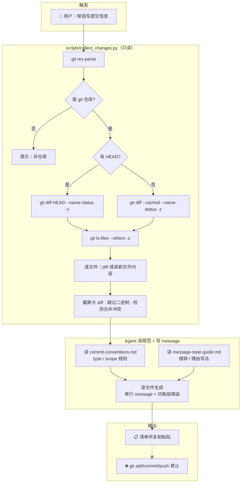

<div align="center">

# 📝 Commit Message Assistant

**提交前为每个改动文件自动生成可粘贴的 Conventional Commits 提交信息**

*Read-only commit message generator · Never commits for you*

[](https://www.python.org/)
[](https://git-scm.com/)
[](https://conventionalcommits.org/)

[快速开始](#-快速开始) · [工作原理](#️-工作原理) · [核心亮点](#-核心亮点) · [项目结构](#-项目结构)

</div>

---

> 它不替你提交，只把"该怎么写"摆好让你复制粘贴。

Commit Message Assistant 是一个 ZCode 技能，在你 `git commit` 之前，自动为每个有改动的文件生成一条可以直接粘贴的 Conventional Commits 单行 message 和一行功能级理由。

你只管改代码，提交信息交给它。**全程只读，绝不碰 `git add / commit / push`。**

## 🏗️ 工作原理



## ✨ 核心亮点

| 亮点                     | 说明                                                                     | 落点                                         |
| ------------------------ | ------------------------------------------------------------------------ | -------------------------------------------- |
| **只读安全**             | 全程仅调 `rev-parse` / `diff` / `ls-files`，严禁任何写操作               | `collect_changes.py` 全部 git 调用           |
| **逐文件输出**           | 每个改动文件一条单行 message + 一行功能级理由，直接复制粘贴              | SKILL.md Workflow §5                         |
| **Conventional Commits** | type 英文前缀 + 中文正文，scope 按目录自动推断、拿不准就省略             | `references/commit-conventions.md`           |
| **全类型覆盖**           | 新增 / 修改 / 删除 / 改名 / 合并冲突，按类型分组、组内字母序             | `collect_changes.py` parse_name_status       |
| **全新仓库支持**         | 无 HEAD 时自动 fallback 到 `git diff --cached`，staged 文件不丢失        | `collect_changes.py` collect                 |
| **大文件 & 二进制**      | diff > 200 行截断前 80 行；新文件 > 300 行截断；二进制先读 8192 字节判定 | `collect_changes.py` trunc_lines / is_binary |
| **删除文件轻量处理**     | 删除文件只输出文件名与 HEAD 中行数，不输出冗长全量 diff                  | `collect_changes.py` head_line_count         |
| **冲突检测**             | 检测 `U`（unmerged）状态，提醒用户先解决冲突再提交                       | `collect_changes.py` collect                 |

## 🚀 快速开始

### 0️⃣ 环境要求

| 组件                                                              | 版本  | 用途                                  |
| ----------------------------------------------------------------- | ----- | ------------------------------------- |
| Python                                                            | 3.10+ | 运行采集脚本                          |
| Git                                                               | 2.0+  | 读取仓库改动（只读）                  |
| Claude Code / Codex / Cursor / OpenClaw / Gemini CLI 等，任选其一 | 最新  | Skill 本体是 Markdown，运行时负责执行 |

### 1️⃣ 安装

打开你正在用的 agent，直接告诉它：

```
帮我安装这个 skill：https://github.com/WeatherCore/Code-Explain-Expert
```

### 2️⃣ 触发

在有未提交改动的 git 仓库目录下，对 Agent 运行时 说：

```
帮我写提交信息
```

或任意同义表述：`commit message` / `这些改动怎么写提交` / `帮我生成提交备注`。

### 3️⃣ 复制粘贴

技能输出逐文件清单，每条格式：

```
### src/auth/login.py
feat(auth): 增加邮箱登录
*理由：新增邮箱登录后端校验与查重逻辑，供 /login/email 接口使用。*
```

复制第二行（message 行）到你的 `git commit -m "..."` 即可，理由行供你判断和微改，不进 commit。

### 4️⃣ 切换规范（可选）

| 你说的话   | 效果                         |
| ---------- | ---------------------------- |
| *（默认）* | type 英文 + 正文中文         |
| 用英文     | type 与正文都用英文          |
| 自由格式   | 不加 type 前缀，直接中文描述 |

## 📦 项目结构

```
commit-message-assistant-v1.0.0/
├── 📄 SKILL.md                   # 技能入口：触发、工作流、约束、校验
├── 📂 scripts/
│   └── 🔧 collect_changes.py     # 只读采集：改动文件列表 + diff/内容，截断与二进制处理
├── 📂 references/
│   ├── 📖 commit-conventions.md   # Conventional Commits type 列表 + scope 规则
│   └── 📖 message-style-guide.md # 单行 message 措辞、多变更折叠、理由写法、好坏对照
└── 📂 examples/
    └── 📄 sample-output.md       # 三种典型场景的示例输出
```

逐文件深度说明见 [SKILL.md](SKILL.md)，示例输出见 [examples/sample-output.md](examples/sample-output.md)。

<details><summary><b>🔧 可调参数</b>（点击展开）</summary>

`collect_changes.py` 顶部的阈值常量可根据项目规模调整：

| 常量                   | 默认值 | 含义                               |
| ---------------------- | ------ | ---------------------------------- |
| `LARGE_DIFF_LINES`     | 200    | tracked 文件 diff 超过此行数则截断 |
| `KEEP_DIFF_LINES`      | 80     | 截断后保留的前 N 行                |
| `UNTRACKED_FULL_LINES` | 300    | 新文件行数 ≤ 此值则读全文          |
| `KEEP_UNTRACKED_LINES` | 80     | 新文件截断后保留的前 N 行          |
| `MANY_FILES`           | 50     | 改动文件超过此数则顶部加提醒       |

</details>

## 🛡️ 安全约束

这是本技能的**最高优先级规则**：

| 允许（只读）             | 禁止（绝不执行） |
| ------------------------ | ---------------- |
| `git status`             | `git add`        |
| `git diff`               | `git commit`     |
| `git diff --cached`      | `git push`       |
| `git diff --name-status` | `git merge`      |
| `git log`                | `git rebase`     |
| `git show`               | `git reset`      |
| `git ls-files`           | `git checkout`   |
| `git rev-parse`          | `git stash`      |

若你对技能说"直接提交/推上去"，它不会执行任何写操作，只会重新生成清单并提醒你手动提交。

## 🗺️ Roadmap

- [x] 逐文件 Conventional Commits message + 功能级理由
- [x] 按类型分组（新增→修改→删除→改名）+ 字母序
- [x] 大 diff / untracked 大文件截断
- [x] 二进制文件自动跳内容留文件名
- [x] 只读安全约束（grep 可验证）
- [x] 全新仓库支持（无 HEAD 时 fallback 到 --cached）
- [x] 合并冲突检测与提醒
- [x] 删除文件轻量处理（仅文件名+行数）
- [x] Windows 编码兼容
- [ ] 支持指定子目录 / 单文件生成
- [ ] 支持 PR 描述生成

---

<div align="center">

**觉得有用？给个 ⭐ Star 吧！**

</div>
